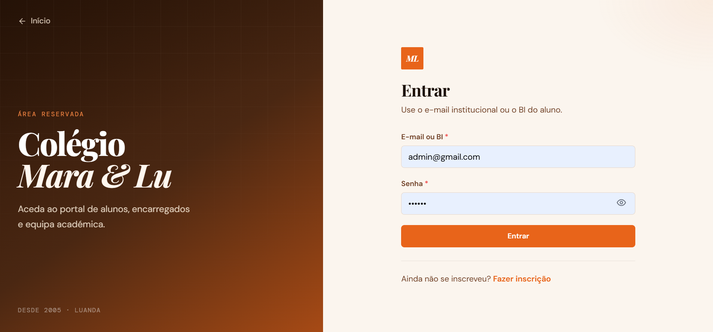
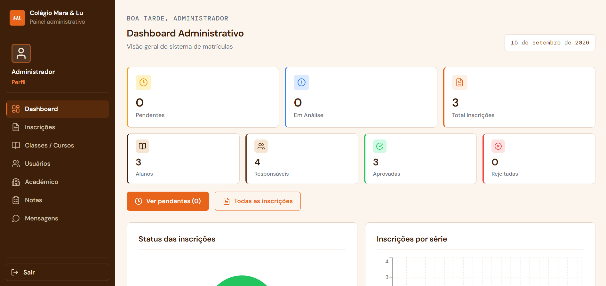
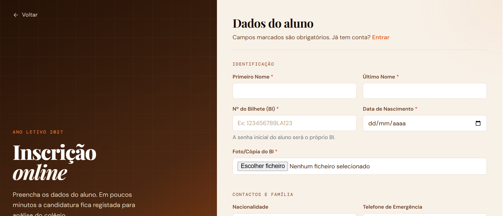
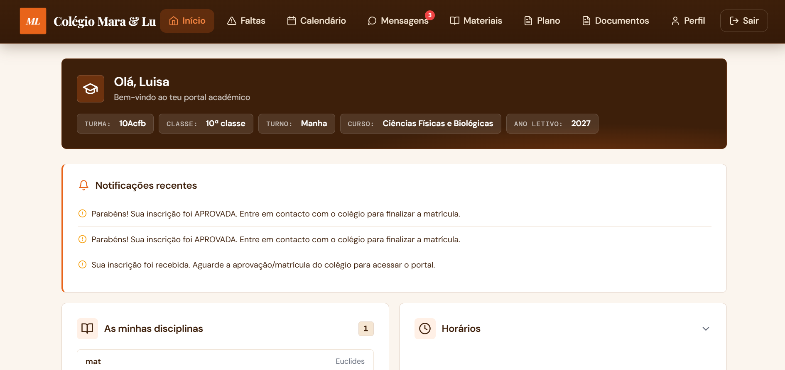

# Colégio Mara & Lu

**School enrollment & academic management platform** — Full Stack portfolio flagship.

React · Node.js/Express · MySQL · JWT/RBAC · Jest · Playwright · Vercel · Render

---

## Problem

Schools often manage enrollments, grades, absences, and family communication across spreadsheets, paper, and fragmented chats. That creates:

- Slow enrollment review
- Unclear vacancy control
- Weak audit of who changed what
- No single place for students/families to follow academic progress

## Solution

A role-based web system that covers the full cycle:

**Public application → staff review → enrollment → academic year (grades, absences, materials, messaging)**

Built as a real product architecture (SPA + secured API + MySQL), not a classroom CRUD demo.

## Live demo

| Layer | URL |
|-------|-----|
| Frontend | https://colegio-mara-lu.vercel.app/ |
| Backend | https://colegio-mara-lu-backend.onrender.com |
| Health | https://colegio-mara-lu-backend.onrender.com/health |

> Render free tiers may cold-start; wait a few seconds on first request.

## Screenshots

### Landing


### Login


### Admin dashboard


### Public enrollment


### Student portal


More capture notes: [`screenshots/README.md`](./screenshots/README.md)

## Architecture

```text
React (Vercel) ──HTTPS/REST──▶ Express API (Render) ──▶ MySQL
                                      │
                                      └──▶ File storage (Supabase)
```

Deep dive: [`docs/ARCHITECTURE.md`](./docs/ARCHITECTURE.md)

## Features

| Area | Highlights |
|------|------------|
| **Auth & RBAC** | Admin, coordenador, professor, aluno — scoped coordinator access |
| **Enrollments** | Public form, document upload, status workflow, vacancy sync |
| **Academic** | Courses, subjects, classes, schedules, curriculum plans |
| **Grades** | Period model (1PP/1PT…), grade sheets, edit rules |
| **Attendance** | Absences + justifications |
| **Comms** | Notifications + internal messages |
| **Dashboards** | Staff KPIs, charts, vacancy table |

## Tech stack

**Frontend:** React 18, React Router, Axios, Recharts, Lucide, React Toastify, CRA  
**Backend:** Node.js, Express, mysql2, JWT, bcryptjs, Helmet, express-rate-limit, Multer, cookie-parser  
**Data / files:** MySQL, Supabase storage  
**Tests:** Jest + Testing Library, Playwright  
**Deploy:** Vercel + Render  

## Security

- JWT in **httpOnly** cookies
- bcrypt password hashing + password policy
- Rate limiting (API, login, public enrollment)
- Per-account login lockout
- Helmet + CORS allowlist
- Upload type/size filters
- Secrets only via environment variables

Details: [`docs/SECURITY.md`](./docs/SECURITY.md)

## Tests

```bash
cd frontend
npm test          # unit / component
npm run test:e2e  # Playwright (needs running stack)
npm run build     # production build

cd ../backend
npm test          # unit (no DB required)
```

Guide: [`docs/TESTING.md`](./docs/TESTING.md)

## Documentation

| Doc | Topic |
|-----|--------|
| [ARCHITECTURE.md](./docs/ARCHITECTURE.md) | System design |
| [SECURITY.md](./docs/SECURITY.md) | Auth, RBAC, hardening |
| [API.md](./docs/API.md) | Endpoint map |
| [DATABASE.md](./docs/DATABASE.md) | Schema & evolution |
| [TESTING.md](./docs/TESTING.md) | Test strategy |
| [DEPLOYMENT.md](./docs/DEPLOYMENT.md) | Vercel / Render / env |
| [DECISIONS.md](./docs/DECISIONS.md) | ADRs |
| [INSTALACAO.md](./INSTALACAO.md) | Local install |

## Quick start

```bash
# Database
# Create MySQL DB and run backend/database.sql

# Backend
cd backend
cp .env.example .env   # fill DB + JWT_SECRET
npm install
npm run dev            # http://localhost:49152

# Frontend
cd frontend
cp .env.example .env   # optional when using proxy
npm install
npm start              # http://localhost:3000
```

Full checklist: [`INSTALACAO.md`](./INSTALACAO.md)

## Challenges & learnings

- Cross-origin auth between Vercel and Render (cookie `Secure` / `SameSite`)
- Coordinator scope vs global admin without leaking privileges
- Dense admin tables at 100% zoom without useless horizontal scroll
- Enrollment concurrency (`updated_at` / 409 conflicts)
- Keeping Design System tokens consistent across admin, professor, and portal

## Technical decisions

See [`docs/DECISIONS.md`](./docs/DECISIONS.md) — cookie sessions, RBAC refresh, boot-time schema helpers, public enrollment without open signup.

## Roadmap

- [x] Backend automated test suite (unit: auth, RBAC, uploads, password policy)
- [ ] OpenAPI / Swagger export
- [ ] Expand Playwright coverage (enrollment happy path)
- [ ] Observability (structured metrics dashboard)
- [ ] Optional admin 2FA

## Author

**Adnírcio Inocêncio** — Software / Full Stack Developer  
GitHub: [keny343](https://github.com/keny343)

---

Licensed for portfolio demonstration. Do not commit secrets. Use `.env` examples only.
