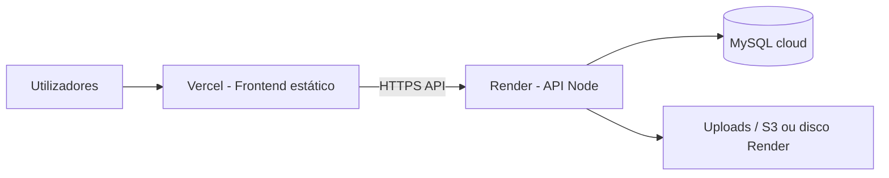

# Plano de hospedagem gratuita — Colégio Mara & Lu

> Fase seguinte à instalação local. Relatório completo: [RELATORIO.md](./RELATORIO.md) · Instalação: [../INSTALACAO.md](../INSTALACAO.md)

---

## Arquitectura recomendada (gratuita)



| Componente | Serviço sugerido | Plano free | URL típica |
|------------|------------------|------------|------------|
| **Frontend** React | [Vercel](https://vercel.com) | Hobby | `colegio.vercel.app` |
| **Backend** Express | [Render](https://render.com) | Web Service free | `colegio-api.onrender.com` |
| **MySQL** | [Railway](https://railway.app) ou [Aiven](https://aiven.io) | Trial / free tier | host:porta na cloud |
| **Domínio** | Vercel + Render | Subdomínios grátis | CNAME opcional |

**Alternativa tudo-em-um:** [Railway](https://railway.app) — API + MySQL no mesmo projecto (limite de horas/mês no free).

---

## Fase 1 — Preparar o código

### 1.1 Variáveis de ambiente (produção)

**Backend (Render/Railway):**

```env
PORT=10000
DB_HOST=<host-mysql-cloud>
DB_USER=<user>
DB_PASSWORD=<password>
DB_NAME=colegio_mara_lu
JWT_SECRET=<chave-64-caracteres-aleatorios>
UPLOAD_PATH=/tmp/uploads
NODE_ENV=production
```

**Frontend (Vercel):**

```env
REACT_APP_API_URL=https://colegio-api.onrender.com/api
```

### 1.2 CORS

Em `backend/src/server.js`, alterar origem CORS para o domínio Vercel:

```javascript
app.use(cors({
  origin: process.env.FRONTEND_URL || 'http://localhost:3000',
  credentials: true,
}));
```

Definir `FRONTEND_URL=https://seu-app.vercel.app` no Render.

### 1.3 Uploads em produção

O disco do Render é **efémero** — ficheiros em `./uploads` podem perder-se ao reiniciar.

Opções:

| Opção | Custo | Esforço |
|-------|-------|---------|
| [Cloudinary](https://cloudinary.com) free | Grátis até limite | Médio — alterar multer |
| AWS S3 free tier 12 meses | Grátis inicial | Médio |
| Manter em disco Render | Grátis | Baixo — aceitar perda ocasional |

Para MVP: disco Render + backup manual periódico da pasta `uploads`.

---

## Fase 2 — Base de dados na cloud

1. Criar instância MySQL (Railway ou Aiven).  
2. Importar estrutura:

   ```bash
   mysql -h HOST -u USER -p < backend/database.sql
   ```

3. Correr migrações:

   ```bash
   node backend/scripts/migrate-notas-angola.js
   ```

4. Copiar `DB_HOST`, `DB_USER`, `DB_PASSWORD`, `DB_NAME` para o Render.

---

## Fase 3 — Deploy do backend (Render)

1. Conta em [render.com](https://render.com) → **New Web Service**.  
2. Ligar repositório GitHub do projecto.  
3. **Root directory:** `backend`  
4. **Build command:** `npm install`  
5. **Start command:** `npm start`  
6. Adicionar todas as variáveis `.env`.  
7. Deploy → anotar URL `https://xxx.onrender.com`.

**Nota:** O plano free “adormece” após inactividade — primeiro pedido pode demorar ~30 s.

---

## Fase 4 — Deploy do frontend (Vercel)

1. Conta em [vercel.com](https://vercel.com) → **Import Project**.  
2. **Root directory:** `frontend`  
3. **Build command:** `npm run build`  
4. **Output:** `build`  
5. Variável `REACT_APP_API_URL` = URL da API + `/api`  
6. Deploy.

---

## Fase 5 — Domínio personalizado (opcional)

| Onde | Acção |
|------|--------|
| **Vercel** | Settings → Domains → adicionar `www.colegio.ao` (exemplo) |
| **Render** | Custom Domain → `api.colegio.ao` |
| **DNS** | CNAME `www` → Vercel · CNAME `api` → Render |

HTTPS é automático em Vercel e Render.

---

## Checklist antes de publicar

- [ ] Alterar senha do admin `Admin@123`  
- [ ] `JWT_SECRET` forte e único em produção  
- [ ] Testar login, lançamento de notas e upload de foto  
- [ ] Backup da base MySQL (`mysqldump`)  
- [ ] Confirmar CORS com URL real do frontend  
- [ ] Executar `migrate-notas-angola.js` na BD de produção  

---

## Limitações do plano gratuito

| Serviço | Limitação |
|---------|-----------|
| Render | Sleep após 15 min sem tráfego |
| Vercel | 100 GB bandwidth/mês (suficiente para escola) |
| Railway MySQL | Créditos mensais limitados |
| Uploads locais | Não persistentes no Render free |

---

## Ordem de execução (resumo)

1. ✅ Relatório e instalação local (`RELATORIO.md`, `INSTALACAO.md`)  
2. ⬜ Repositório no GitHub (se ainda não estiver)  
3. ⬜ MySQL na cloud + import `database.sql`  
4. ⬜ Deploy API Render  
5. ⬜ Deploy frontend Vercel + `REACT_APP_API_URL`  
6. ⬜ Testes end-to-end em produção  
7. ⬜ Domínio personalizado (opcional)  

Quando quiser iniciar a **Fase 2** (deploy real), podemos configurar `server.js` (CORS), ficheiros `render.yaml` / `vercel.json` e scripts de build no repositório.
