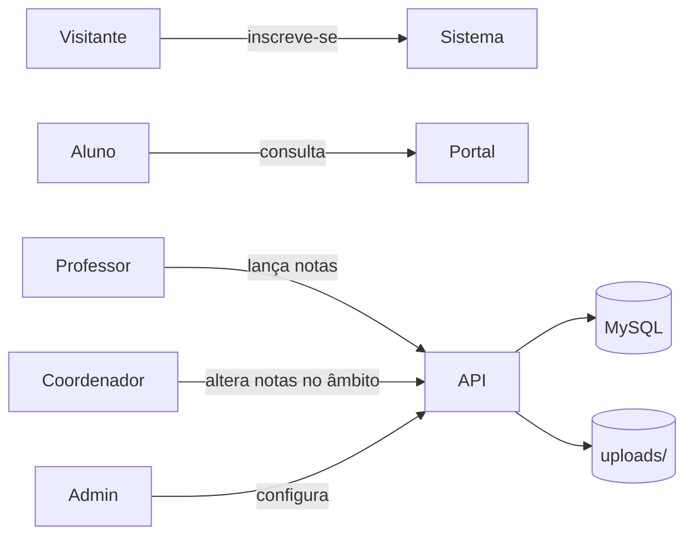
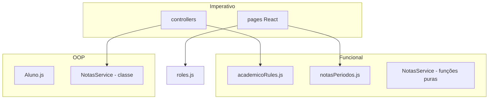
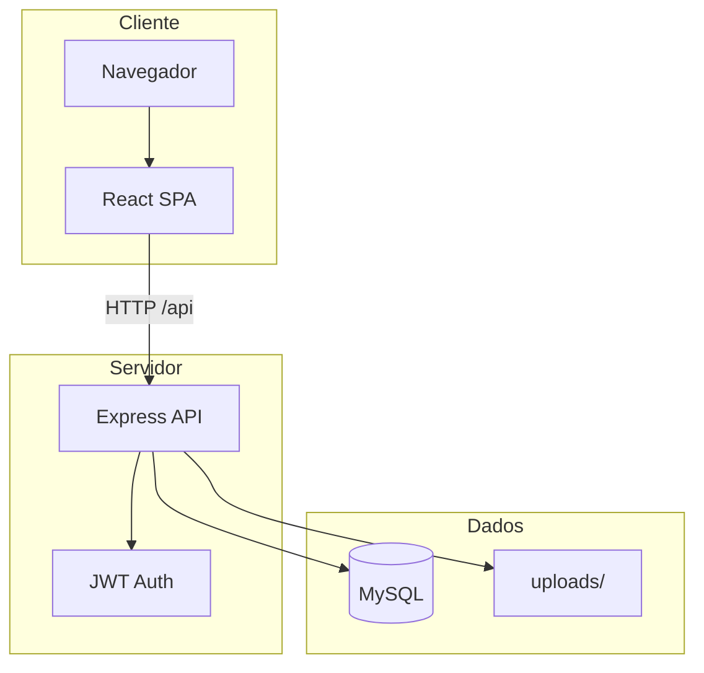
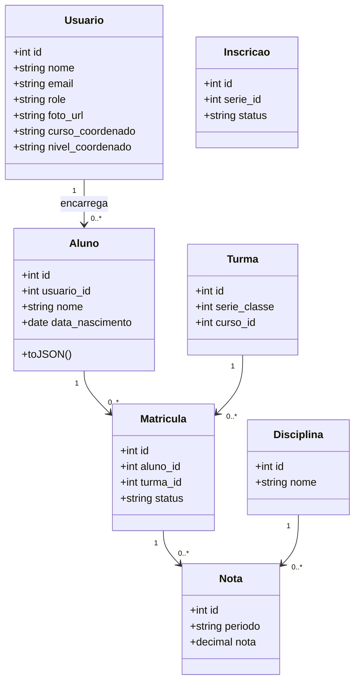
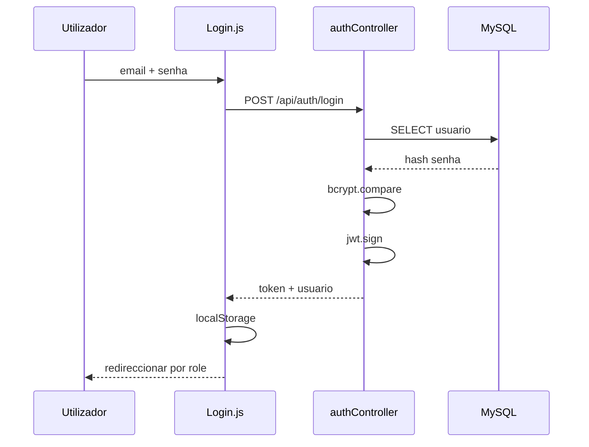
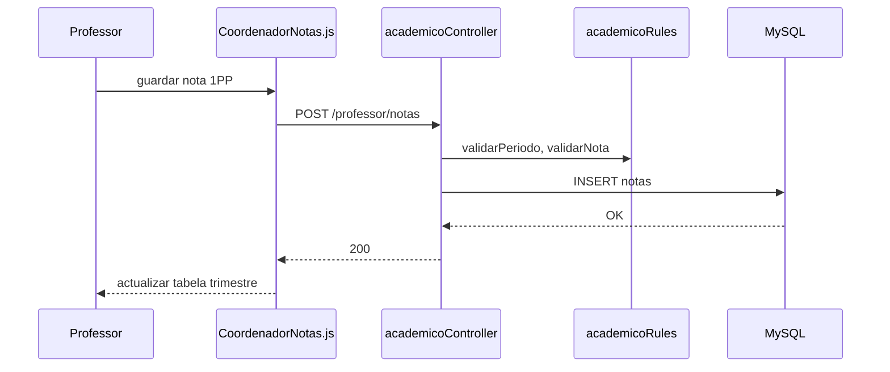
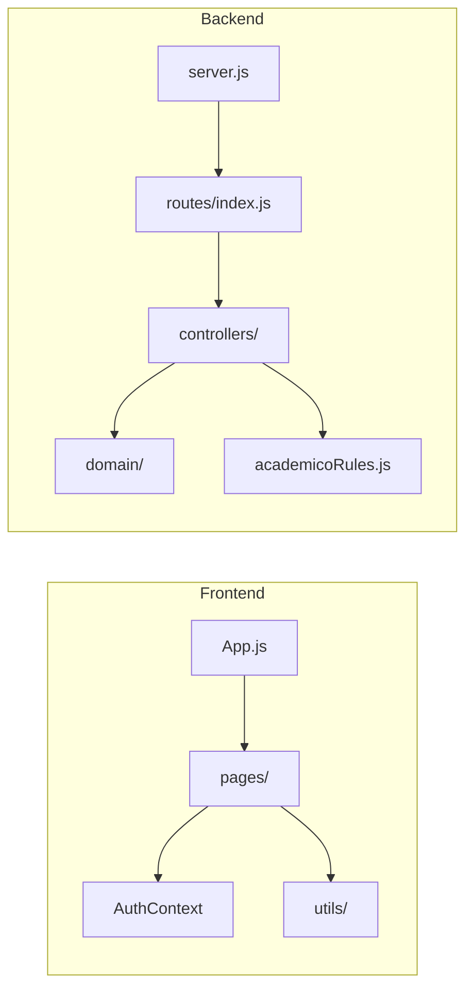
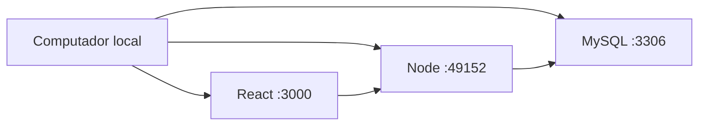

# Relatório Técnico — Sistema de Gestão Académica  
## Colégio Mara & Lu

**Versão do sistema:** 1.0  
**Stack:** React · Node.js/Express · MySQL  
**Documento:** Introdução → Conclusão (UML, casos de uso, paradigmas, actores)

---

## Sumário

1. [Introdução](#1-introdução)  
2. [Contextualização e problema](#2-contextualização-e-problema)  
3. [Objectivos](#3-objectivos)  
4. [Actores do sistema](#4-actores-do-sistema)  
5. [Casos de uso](#5-casos-de-uso)  
6. [Diagrama de casos de uso (UML)](#6-diagrama-de-casos-de-uso-uml)  
7. [Requisitos](#7-requisitos)  
8. [Paradigmas de programação e ficheiros](#8-paradigmas-de-programação-e-ficheiros)  
9. [Arquitectura do sistema](#9-arquitectura-do-sistema)  
10. [Diagramas UML](#10-diagramas-uml)  
11. [Modelo de dados](#11-modelo-de-dados)  
12. [Tecnologias e estrutura do projecto](#12-tecnologias-e-estrutura-do-projecto)  
13. [Módulos implementados](#13-módulos-implementados)  
14. [Modelo de avaliação (Angola)](#14-modelo-de-avaliação-angola)  
15. [Conclusão](#15-conclusão)  
16. [Trabalhos futuros](#16-trabalhos-futuros)  
17. [Referências](#17-referências)

---

## 1. Introdução

Este relatório descreve o **Sistema de Matrículas e Gestão Académica** desenvolvido para o **Colégio Mara & Lu**, uma aplicação web que centraliza inscrições, matrículas, lançamento de notas segundo o modelo angolano (três trimestres com prova parcial e prova trimestral), registo de faltas, materiais didácticos, plano curricular e consulta pelo aluno no portal.

A solução adopta arquitectura **cliente-servidor**: interface em **React** e API REST em **Node.js** com persistência em **MySQL**, autenticação **JWT** e controlo de acesso por **papéis** (admin, coordenador, professor, aluno).

O documento serve como base académica e técnica: identifica actores e casos de uso, localiza os **três paradigmas de programação** no código-fonte, apresenta diagramas **UML** (casos de uso, classes, sequência, componentes) e liga cada módulo aos ficheiros do repositório.

---

## 2. Contextualização e problema

Instituições de ensino necessitam de processos digitais para:

- Inscrições públicas com validação de vagas por classe/curso  
- Aprovação administrativa e matrícula em turmas  
- Lançamento de notas por disciplina e período, com regras de escala (0–10 ou 0–20)  
- Separação de competências: professor lança; coordenador altera no seu ciclo/curso  
- Consulta transparente pelo aluno (notas por trimestre, médias, horários, faltas)

Sem um sistema integrado, há risco de duplicação de dados, falhas de permissão e dificuldade em calcular médias trimestrais e anuais.

---

## 3. Objectivos

### 3.1 Objectivo geral

Desenvolver uma plataforma web segura e multi-utilizador para a gestão académica do colégio.

### 3.2 Objectivos específicos

| # | Objectivo |
|---|-----------|
| O1 | Permitir inscrição pública e fluxo de aprovação |
| O2 | Gerir utilizadores, séries, cursos, turmas e disciplinas |
| O3 | Lançar e consultar notas em 6 períodos (3 trimestres) |
| O4 | Calcular médias por trimestre, por disciplina e geral (paradigma funcional) |
| O5 | Restringir acções por papel e âmbito de coordenação |
| O6 | Disponibilizar portal do aluno com notas, horários e faltas |
| O7 | Partilhar materiais e plano curricular |

---

## 4. Actores do sistema

| Actor | Descrição | Autenticação |
|--------|-----------|--------------|
| **Visitante** | Utilizador não autenticado; vê página inicial e formulário de inscrição | Não |
| **Aluno** | Conta com `role = aluno`; consulta portal, notas, faltas, documentos | Sim (JWT) |
| **Encarregado** | Usa a mesma conta do aluno para inscrições e “meus alunos” (quando aplicável) | Sim |
| **Professor** | Lança notas nas disciplinas atribuídas, faltas e materiais | Sim |
| **Coordenador** | Professor ou utilizador com `nivel_coordenado` ou `curso_coordenado`; gere inscrições e altera notas no âmbito | Sim |
| **Administrador** | Acesso total: utilizadores, séries, académico, designar coordenadores | Sim |
| **Sistema externo** | MySQL (persistência), armazenamento de ficheiros em `uploads/` | — |



---

## 5. Casos de uso

### 5.1 Lista de casos de uso

| ID | Caso de uso | Actor principal | Ficheiros principais |
|----|-------------|-----------------|----------------------|
| UC01 | Autenticar-se | Todos (excepto visitante) | `Login.js`, `authController.js`, `AuthContext.js` |
| UC02 | Inscrever aluno (público) | Visitante | `InscricaoPublica.js`, `publicController.js` |
| UC03 | Aprovar/rejeitar inscrição | Admin, Coordenador | `AdminInscricoes.js`, `inscricoesController.js` |
| UC04 | Gerir utilizadores e designar coordenador | Admin | `AdminPages.js`, `extrasController.js` |
| UC05 | Gerir séries e vagas | Admin | `AdminPages.js`, `extrasController.js` |
| UC06 | Gerir cursos, turmas, disciplinas | Admin, Coordenador | `AdminAcademico.js`, `academicoController.js` |
| UC07 | Atribuir professor à turma/disciplina | Admin, Coordenador | `AdminAcademico.js`, `academicoController.js` |
| UC08 | Matricular aluno em turma | Admin, Coordenador | `AdminAcademico.js`, `academicoController.js` |
| UC09 | Lançar nota (novo período) | Professor | `CoordenadorNotas.js`, `academicoController.js` |
| UC10 | Alterar nota já lançada | Coordenador, Admin | `CoordenadorNotas.js`, `academicoController.js` |
| UC11 | Consultar notas da turma | Admin, Coordenador, Professor | `CoordenadorNotas.js`, `academicoController.js` |
| UC12 | Consultar notas no portal | Aluno | `Portal.js`, `alunoPortalController.js`, `NotasService.js` |
| UC13 | Registar faltas | Professor | `academicoController.js` |
| UC14 | Consultar faltas | Aluno | `Faltas.js`, `alunoPortalController.js` |
| UC15 | Enviar/consultar materiais | Professor, Aluno | `ProfessorMateriais.js`, `materiaisController.js` |
| UC16 | Plano curricular | Coordenador, leitura geral | `PlanoCurricular.js`, `materiaisController.js` |
| UC17 | Actualizar perfil e fotografia | Todos autenticados | `Perfil.js`, `SidebarUserBlock.js`, `authController.js` |
| UC18 | Notificações | Aluno, encarregado | `Notificacoes.js`, `extrasController.js` |

### 5.2 Relações entre casos de uso

- **UC09** inclui validação de período (`1PP`…`3PT`) e limites de nota → `academicoRules.js`  
- **UC10** estende **UC09** com regra: só coordenador/admin se a nota já existir  
- **UC02** pode gerar **UC03** após submissão de documentos  

---

## 6. Diagrama de casos de uso (UML)

```mermaid
usecaseDiagram
  actor Visitante
  actor Aluno
  actor Professor
  actor Coordenador
  actor Admin

  rectangle "Sistema Colégio Mara e Lu" {
    usecase "UC01 Login" as UC01
    usecase "UC02 Inscrição pública" as UC02
    usecase "UC03 Gerir inscrições" as UC03
    usecase "UC04 Gerir utilizadores" as UC04
    usecase "UC06 Académico" as UC06
    usecase "UC09 Lançar notas" as UC09
    usecase "UC10 Alterar notas" as UC10
    usecase "UC12 Portal notas" as UC12
    usecase "UC13 Faltas" as UC13
    usecase "UC15 Materiais" as UC15
    usecase "UC17 Perfil" as UC17
  }

  Visitante --> UC02
  Aluno --> UC01
  Aluno --> UC12
  Aluno --> UC17
  Professor --> UC01
  Professor --> UC09
  Professor --> UC13
  Professor --> UC15
  Coordenador --> UC03
  Coordenador --> UC06
  Coordenador --> UC10
  Admin --> UC04
  Admin --> UC06
  Admin --> UC10
  UC10 ..> UC09 : extend
```

---

## 7. Requisitos

### 7.1 Funcionais

- RF01: Login com e-mail ou BI e senha  
- RF02: Inscrição com upload de documentos  
- RF03: Papéis e permissões por rota e middleware  
- RF04: Seis períodos de avaliação por disciplina  
- RF05: Médias automáticas por trimestre e anual  
- RF06: Sidebar administrativa com perfil e logout  

### 7.2 Não funcionais

- RNF01: API REST com JSON  
- RNF02: Senhas com bcrypt  
- RNF03: Interface responsiva (CSS em `index.css`)  
- RNF04: Upload até 5 MB (documentos) / 3 MB (avatar)  

---

## 8. Paradigmas de programação e ficheiros

O projecto combina **três paradigmas**, conforme requisito académico:

### 8.1 Paradigma funcional

Funções puras, sem efeitos secundários: validação, médias, filtros de coordenação.

| Ficheiro | Responsabilidade |
|----------|------------------|
| `backend/src/utils/academicoRules.js` | `validarPeriodo`, `validarNota`, `mediaTrimestre`, `mediaPeriodos`, `coordenadorPodeGerirTurma`, `PERIODOS_VALIDOS`, `TRIMESTRES` |
| `backend/src/domain/NotasService.js` | `agruparPorDisciplina`, `mediaGlobal`, `respostaPortal` (composição de funções) |
| `frontend/src/utils/roles.js` | `podeAcederNotas`, `podeEditarNotas`, `temEscopoCoordenacao` |
| `frontend/src/utils/notasPeriodos.js` | `mediaTrimestre`, `mediaAnual`, `normalizarPeriodos` |

### 8.2 Paradigma orientado a objectos (OOP)

Classes com estado e métodos de instância.

| Ficheiro | Classe / conceito |
|----------|-------------------|
| `backend/src/domain/Aluno.js` | Classe `Aluno`: `fromRow`, `toJSON`, `dadosParaAtualizacao` |
| `backend/src/domain/NotasService.js` | Classe `NotasService` (métodos estáticos de serviço de domínio) |

### 8.3 Paradigma imperativo

Fluxos sequenciais, mutação de estado, I/O e SQL.

| Área | Ficheiros |
|------|-----------|
| API HTTP | `backend/src/controllers/*.js` (8 controllers) |
| Rotas | `backend/src/routes/index.js` |
| Middleware | `backend/src/middleware/auth.js` |
| Migrações | `backend/scripts/migrate-academico.js`, `migrate-notas-angola.js` |
| Interface React | `frontend/src/pages/*.js`, `frontend/src/components/*.js` |
| Estado global | `frontend/src/contexts/AuthContext.js` |

### 8.4 Resumo visual



---

## 9. Arquitectura do sistema



| Camada | Tecnologia | Pasta |
|--------|------------|-------|
| Apresentação | React 18, React Router | `frontend/src/` |
| API | Express 4 | `backend/src/` |
| Regras de negócio | JS (funcional + OOP) | `backend/src/utils`, `domain` |
| Persistência | mysql2 | `backend/src/config/database.js` |

---

## 10. Diagramas UML

### 10.1 Diagrama de classes (domínio académico)



### 10.2 Diagrama de sequência — Login (UC01)



### 10.3 Diagrama de sequência — Lançar nota (UC09)



### 10.4 Diagrama de componentes



### 10.5 Diagrama de implantação (local)



---

## 11. Modelo de dados

Script principal: **`backend/database.sql`**

Entidades principais: `usuarios`, `alunos`, `inscricoes`, `series`, `cursos`, `turmas`, `disciplinas`, `matriculas`, `notas`, `faltas`, `turma_professores`, `documentos`, `notificacoes`.

Coluna **`notas.periodo`**: `VARCHAR(3)` com valores `1PP`, `1PT`, `2PP`, `2PT`, `3PP`, `3PT`.

Migração em bases antigas: `node backend/scripts/migrate-notas-angola.js`

---

## 12. Tecnologias e estrutura do projecto

| Componente | Tecnologia |
|------------|------------|
| Frontend | React 18, React Router 6, Axios, Lucide Icons |
| Backend | Node.js, Express, JWT, bcrypt, Multer |
| BD | MySQL 8+ |
| Estilos | CSS (`frontend/src/index.css`) |

```
colegio-mara-lu/
├── docs/
│   ├── RELATORIO.md          ← este documento
│   └── RELATORIO-E-HOSPEDAGEM.md
├── INSTALACAO.md             ← guia para outro PC
├── backend/
│   ├── database.sql
│   ├── scripts/
│   └── src/
│       ├── config/
│       ├── controllers/      ← imperativo
│       ├── domain/           ← OOP
│       ├── middleware/
│       ├── routes/
│       └── utils/            ← funcional
└── frontend/
    └── src/
        ├── components/
        ├── contexts/
        ├── pages/            ← imperativo
        └── utils/            ← funcional
```

---

## 13. Módulos implementados

| Módulo | Rotas UI | API |
|--------|----------|-----|
| Autenticação | `/login` | `/api/auth/*` |
| Inscrição pública | `/inscricao` | `/api/public/inscricoes` |
| Admin dashboard | `/admin` | `/api/admin/dashboard` |
| Inscrições staff | `/admin/inscricoes` | `/api/admin/inscricoes` |
| Académico | `/admin/academico` | `/api/staff/*` |
| Notas | `/admin/notas`, `/professor/notas` | `/api/staff/notas`, `/api/professor/notas` |
| Portal aluno | `/portal` | `/api/aluno/*` |
| Perfil | `/admin/perfil`, `/professor/perfil`, `/portal/perfil` | `/api/auth/perfil` |
| Materiais | `/professor/materiais` | `/api/professor/materiais` |
| Plano curricular | `/admin/plano-curricular` | `/api/staff/plano-curricular` |

---

## 14. Modelo de avaliação (Angola)

| Trimestre | Parcial | Trimestral | Média trimestre |
|-----------|---------|------------|-----------------|
| 1º | 1PP | 1PT | média(1PP, 1PT) |
| 2º | 2PP | 2PT | média(2PP, 2PT) |
| 3º | 3PP | 3PT | média(3PP, 3PT) |

**Média anual** = média das três médias trimestrais (quando existirem).  
**Escala:** classes 1ª–6ª → 0–10; 7ª–13ª → 0–20 (`limitesNota` em `academicoRules.js`).

---

## 15. Conclusão

Foi desenvolvido um sistema web completo para o Colégio Mara & Lu, integrando inscrições, gestão académica, notas no formato angolano (seis períodos em três trimestres) e portal do aluno. A separação por **papéis** e **âmbito de coordenação** garante que professores lancem avaliações e coordenadores supervisionem apenas o seu ciclo ou curso.

A aplicação dos **três paradigmas** — funcional nas regras e médias, orientado a objectos nas entidades de domínio, imperativo nos controladores e interfaces — demonstra competência técnica e facilita manutenção.

O sistema está operacional em ambiente local e preparado para a fase seguinte: **instalação noutros computadores** (ver `INSTALACAO.md`) e **hospedagem gratuita** (ver `docs/RELATORIO-E-HOSPEDAGEM.md`).

---

## 16. Trabalhos futuros

- Hospedagem em Render + Vercel + MySQL cloud (fase em curso)  
- Relatórios PDF por turma e exportação Excel  
- Recuperação de senha por e-mail  
- App móvel ou PWA offline limitado  

---

## 17. Referências

- Documentação React: https://react.dev  
- Express.js: https://expressjs.com  
- MySQL 8 Reference Manual  
- UML 2.5 — OMG (diagramas de casos de uso, classes, sequência)  
- Ministério da Educação de Angola — modelo de avaliação por trimestres (contexto pedagógico)

---

*Documento gerado para o projecto Colégio Mara & Lu. Para instalação local consulte `INSTALACAO.md` na raiz do repositório.*
